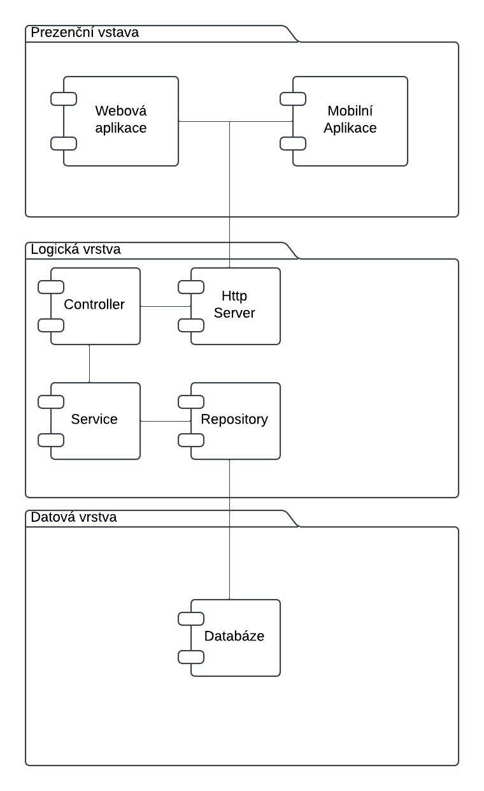

### Architecture

- Architektura systému je rozdělena na 3 vrstvy.

## Prezenční vrstva
- Prezenční vrstva je zodpovědná za zobrazení uživatelského rozhraní a interakci s uživatelem.
- Tohle zobrazení je doručeno pomocí webové a mobilní aplikace

## Logická vrstva
- Skládá se ze 4 částí. Server který zpracuje požadavek a poté ho přepošle controlleru, který pošle důležité data do služby která provádí business logiku a poté se pošlou do repozitáře, který zpracuje data, tak, že je pošle/příjme z databáze

## Datová vrstva
- Datová vrstva je zodpovědná za ukládání dat.

