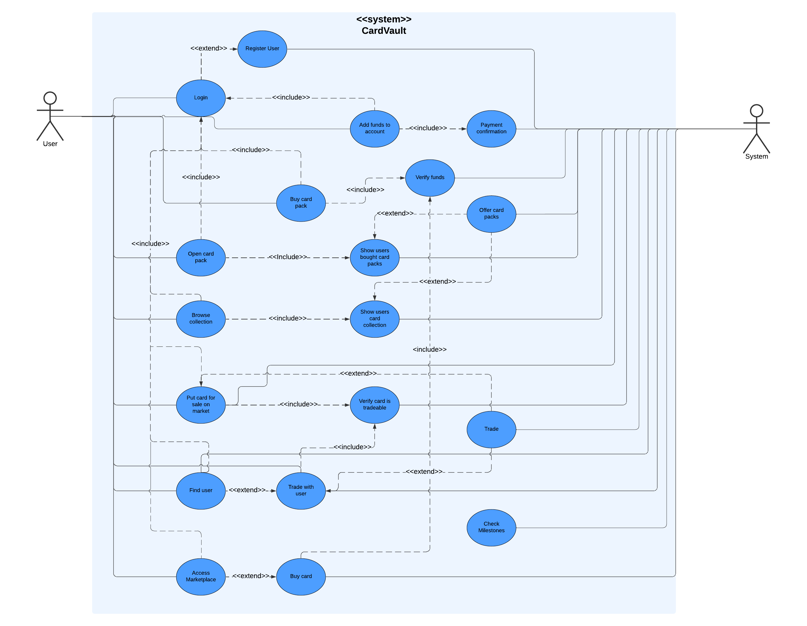
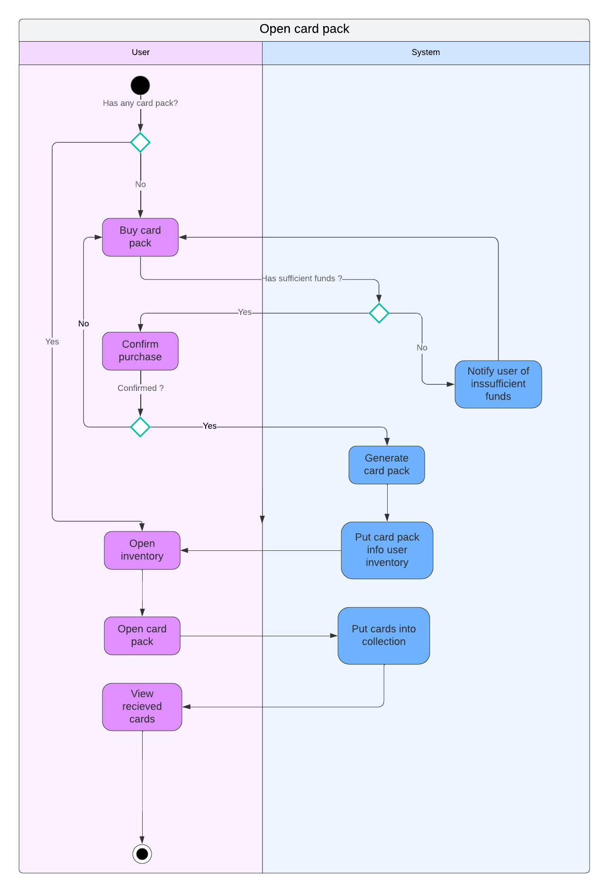
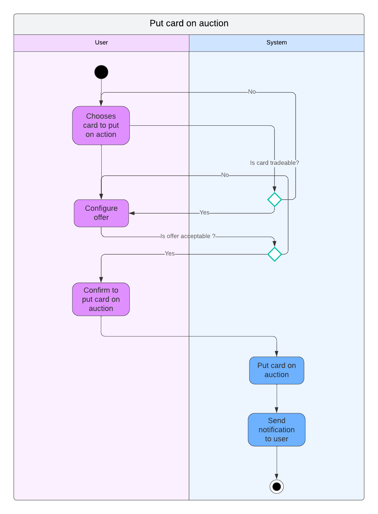
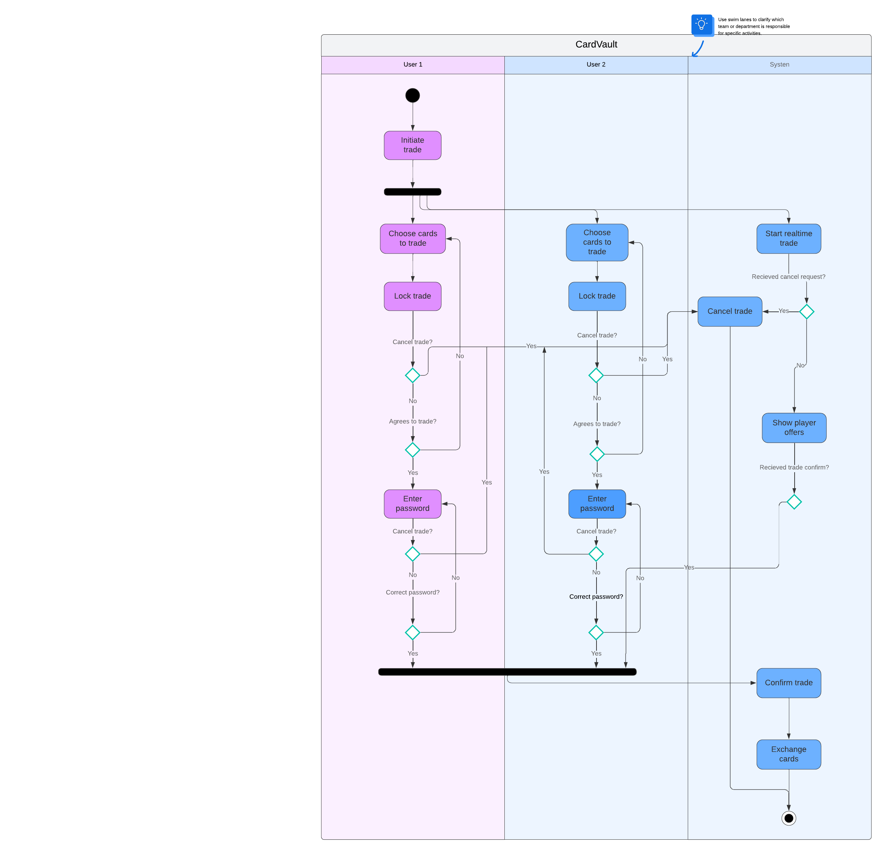

# Functional Specification

## Use-case diagram

## Scenarios

## Scenario 1: Open a Card Pack
- Název: Otevření balíčku karet
- Aktéři: Uživatel, Systém
- Vstupní podmínky: Uživatel má dostatek prostředků na nákup balíčku.
- Spouštěč: Uživatel klikne na tlačítko „Open Card Pack“.

úspěšný scénář:
1. Uživatel přihlášený v systému klikne na tlačítko „Open Card Pack“.
2. Systém ověří, zda má uživatel dostatek prostředků na účtu.
3. Pokud uživatel má dostatek prostředků, systém odečte stanovenou částku.
4. Systém vygeneruje náhodný obsah balíčku (karty).
5. Uživatelovi se zobrazí animace nebo vizuální efekty spojené s otevřením balíčku.
6. Karty z balíčku jsou přidány do uživatelovy kolekce.
7. Uživatel může prohlížet nové karty.

## Scenario 2: Trade Cards
- Název: Vydání karty na prodej na burze
- Aktéři: Uživatel, Systém
- Vstupní podmínky: Uživatel má alespoň jednu kartu ve svém inventáři a je přihlášen do systému.
- Spouštěč: Uživatel vybere kartu z inventáře a klikne na tlačítko "Prodat na burze".

Úspěšný scénář:
1. Uživatel otevře svůj inventář a vybere kartu, kterou chce prodat.
2. Uživatel zadá cenu, za kterou chce kartu prodat nebo za jaké karty chce vyměnit.
3. Systém ověří, zda je cena platná a karta je ve vlastnictví uživatele.
4. Systém přidá kartu na marketplace za zadanou cenu.
5. Uživatel obdrží potvrzení o úspěšném zařazení karty na prodej.
6. Karta je nyní viditelná pro ostatní uživatele v marketplace.
Alternativní scénář:
- Pokud je zadaná cena nižší než minimální cena prodeje, systém zobrazí zprávu „Cena je příliš nízká“ a umožní uživateli zadat novou cenu.

## Scenario 3: Trade Cards
- Název: Realtime obchodování s kartami
- Aktéři: Uživatel 1, Uživatel 2, Systém
- Vstupní podmínky: Oba uživatelé mají alespoň jednu kartu ve svém inventáři a jsou přihlášeni do systému.
- Spouštěč: Uživatel 1 a Uživatel 2 se rozhodnou obchodovat v reálném čase a otevřou rozhraní pro obchodování.

Úspěšný scénář:
1. Zahájení obchodu:
- Uživatel 1 otevře obchodní rozhraní a vybere karty, které chce nabídnout k výměně.
- Uživatel 2 udělá to samé a vybere karty, které chce nabídnout.
2. Nabídka a výběr:
- Uživatel 1 vidí, které karty nabízí Uživatel 2, a může si vybrat karty, které chce získat.
- Uživatel 2 dělá totéž a vybere karty od Uživatel 1, které chce.
3. Zamčení obchodu:
- Jakmile Uživatel 1 a Uživatel 2 vyberou karty, kliknou na tlačítko „Potvrdit obchod“.
- Systém zamkne nabídku, což znamená, že žádná z karet už nemůže být prodána nebo nabídnuta jiným uživatelům.
4. Potvrzení obchodu:
- Systém zobrazí shrnutí obchodu a požádá oba uživatele, aby zadali své heslo pro potvrzení obchodního úmyslu.
- Uživatelé zadají své heslo, které je ověřeno systémem.
5. Dohoda o obchodu:
- Jakmile oba uživatelé potvrdí obchod a hesla jsou ověřena, systém provede výměnu karet.
- Karty jsou automaticky převedeny do inventářů obou uživatelů.
6. Notifikace:
- Oba uživatelé obdrží notifikaci o úspěšném dokončení obchodu a uvidí aktualizovaný stav svého inventáře.

Alternativní scénář:
- Pokud jedno z uživatelských hesel není správné, systém zobrazí zprávu „Chybná hesla“ a obchod se nezrealizuje, dokud nebude zadáno správné heslo obou uživatelů.
- Pokud se jeden z uživatelů rozhodne obchod odmítnout, může kliknout na tlačítko „Zrušit obchod“, což odemkne karty pro další použití.

