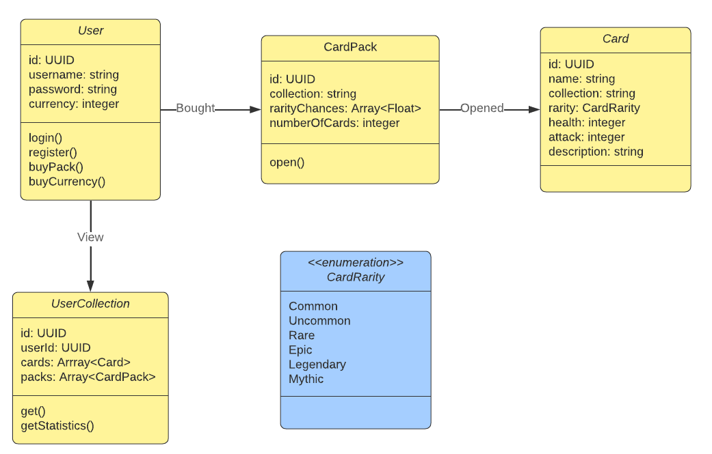

## Conceptual domain model

Model doplňte o tabulky s odhady velikostí entit a jejich množstvím.

Tabulka s přílohami bude mít 1-5mb na záznam a systém počítá se 100 000 až 1 000 000 záznamů.
Tabulka s uživateli bude mít max 500kb na záznam a max 100 000 záznamů.
## Velikost tabulkek
| Tabulka        | Velikost na záznam | Počet záznamů       |
|----------------|--------------------|---------------------|
| User           | 500kb              | 100 000 - 1 000 000 |
| UserCollection | 5mb KB             | 100 000 - 1 000 000 |
| Card           | 1mb                | 196 - 512           |
| Pack           | 1mb                | 15 - 50             |

## Zátěž systému
- Systém očekává v peaku 10000 uživatelů na začátku týdne, kdy se budou uvádět nové týdenní a denní úkoly.
- Při normální zátěži se očekává 1000 uživatelů.

## Typy interakcí
- Nejčastější operace bude typu získání dat - karty, balíčky, statistiky.
Od takových aktivit očekávám největší náročnost, kvůli toho jaké nátury je tenhle systém.
- Další aktivity jsou kupování, prodej, výměna karet. Tyto operace jsou sice náročnější, ale očekávám 
v poměru s předchozími operaci menší využití, tudíž i menší zátež

## Technologie
- Frontend: Nextjs, React, 
- Backend: Java, Spring
- Databáze: PostgreSQL
- Cache: Redis
- Komunikace: GraphQL